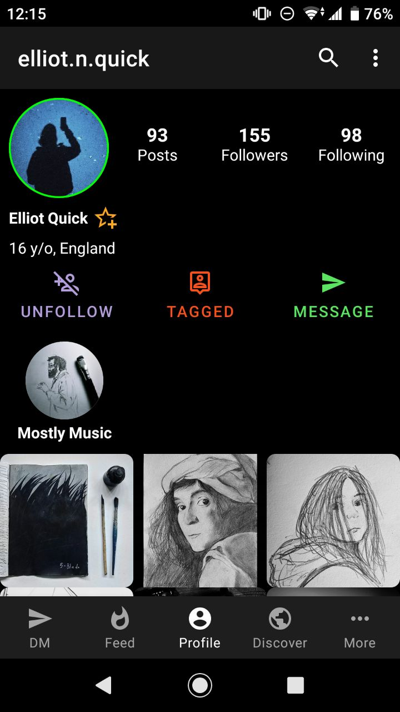
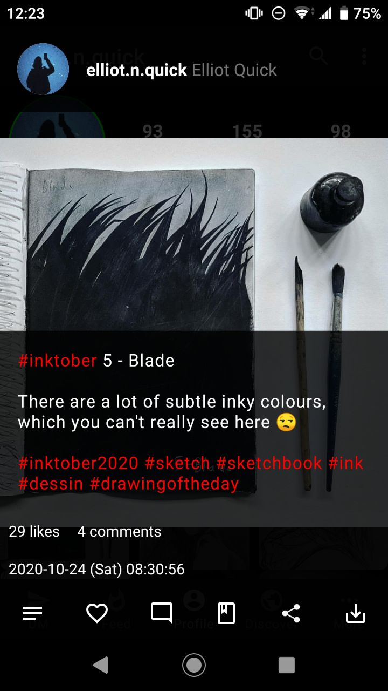
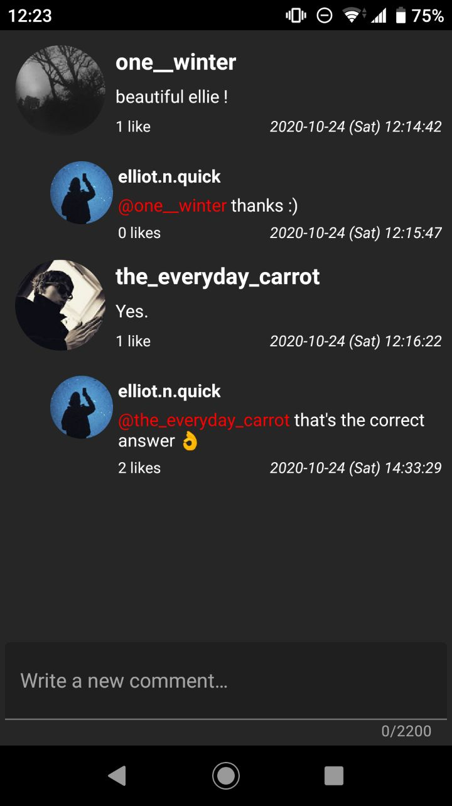
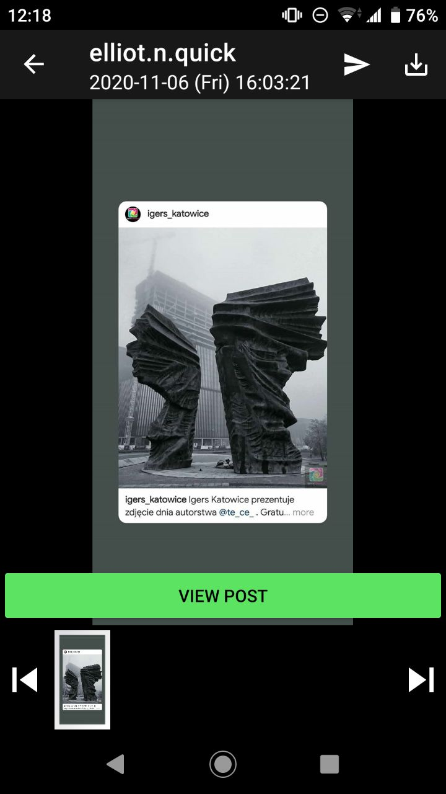
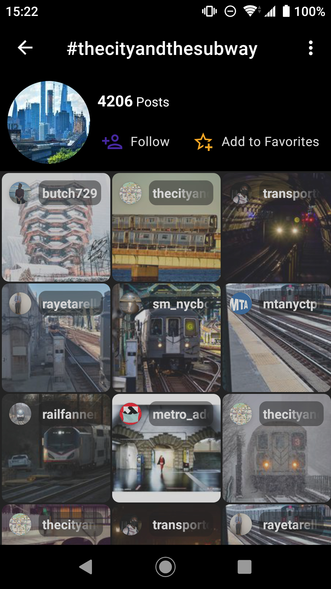
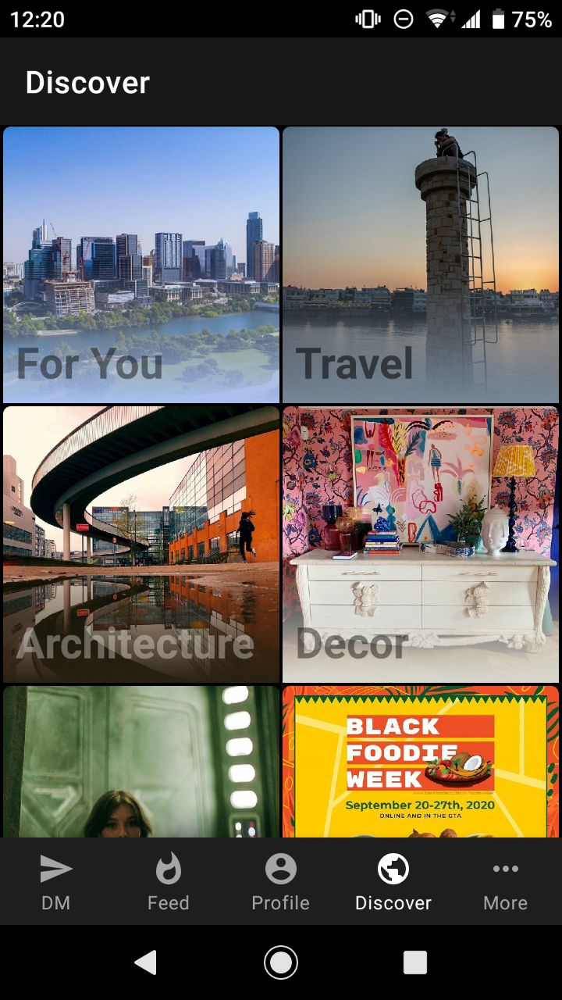

## InstaGrabber

For documentation, visit [InstaGrabber.AustinHuang.me](https://instagrabber.austinhuang.me)

### Download

**By installing, you indicate your acceptance of [Disclosure and Privacy Policy](https://instagrabber.austinhuang.me/disclosure).**

Download from [GitHub releases](https://github.com/austinhuang0131/instagrabber/releases/latest) (recommended). Expand "Assets" and download the APK file. Or...

(...[but they're slow.](https://instagrabber.austinhuang.me/faq#f-droid))

Version status:  vs. 

### Contact us

* Use [GitHub issues](https://github.com/austinhuang0131/instagrabber/issues) when possible.
* Email: [InstaGrabber@AustinHuang.me](mailto:instagrabber@austinhuang.me) (Synced to GitHub issues)
* Matrix: [#InstaGrabber:matrix.org](https://matrix.to/#/#instagrabber:matrix.org)
* Telegram: [@Grabber_App](https://t.me/grabber_app)
* Discord: [https://discord.gg/YtEDzN2](https://discord.gg/YtEDzN2)

### Contributors

<!-- ALL-CONTRIBUTORS-BADGE:START - Do not remove or modify this section -->

<!-- ALL-CONTRIBUTORS-BADGE:END -->

Prominent contributors are listed here in the [all-contributors](https://allcontributors.org/) format. See [emoji key](https://allcontributors.org/docs/en/emoji-key).

<!-- ALL-CONTRIBUTORS-LIST:START - Do not remove or modify this section -->
<!-- prettier-ignore-start -->
<!-- markdownlint-disable -->
<table>
  <tr>
    <td align="center"><a href="https://austinhuang.me"> <b>Austin Huang</b></a> <a href="https://github.com/austinhuang0131/instagrabber/commits?author=austinhuang0131" title="Code">💻</a> <a href="https://github.com/austinhuang0131/instagrabber/commits?author=austinhuang0131" title="Documentation">📖</a> <a href="#question-austinhuang0131" title="Answering Questions">💬</a> <a href="#translation-austinhuang0131" title="Translation">🌍</a> <a href="#userTesting-austinhuang0131" title="User Testing">📓</a> <a href="#ideas-austinhuang0131" title="Ideas, Planning, & Feedback">🤔</a> <a href="#maintenance-austinhuang0131" title="Maintenance">🚧</a></td>
    <td align="center"><a href="https://github.com/ammargitham"> <b>Ammar Githam</b></a> <a href="https://github.com/austinhuang0131/instagrabber/commits?author=ammargitham" title="Code">💻</a> <a href="#design-ammargitham" title="Design">🎨</a> <a href="#ideas-ammargitham" title="Ideas, Planning, & Feedback">🤔</a> <a href="#maintenance-ammargitham" title="Maintenance">🚧</a> <a href="#question-ammargitham" title="Answering Questions">💬</a></td>
    <td align="center"><a href="http://rerolledgeek.blogspot.com/"> <b>AWAiS</b></a> <a href="https://github.com/austinhuang0131/instagrabber/commits?author=AwaisKing" title="Code">💻</a> <a href="#ideas-AwaisKing" title="Ideas, Planning, & Feedback">🤔</a></td>
    <td align="center"><a href="https://github.com/Shadowspear123"> <b>Shadowspear123</b></a> <a href="#blog-Shadowspear123" title="Blogposts">📝</a> <a href="https://github.com/austinhuang0131/instagrabber/issues?q=author%3AShadowspear123" title="Bug reports">🐛</a> <a href="#ideas-Shadowspear123" title="Ideas, Planning, & Feedback">🤔</a> <a href="#question-Shadowspear123" title="Answering Questions">💬</a> <a href="#userTesting-Shadowspear123" title="User Testing">📓</a></td>
  </tr>
</table>

<!-- markdownlint-enable -->
<!-- prettier-ignore-end -->
<!-- ALL-CONTRIBUTORS-LIST:END -->

### License

This app is originally made by [@AwaisKing](https://github.com/AwaisKing) on [GitLab](https://gitlab.com/AwaisKing/instagrabber).

    InstaGrabber
    Copyright (C) 2019  AWAiS        <chapter50000@hotmail.com>
    Copyright (C) 2020  Austin Huang <im@austinhuang.me>
                        Ammar Githam <ammargitham786@gmail.com>

    This program is free software: you can redistribute it and/or modify
    it under the terms of the GNU General Public License as published by
    the Free Software Foundation, either version 3 of the License, or
    (at your option) any later version.

    This program is distributed in the hope that it will be useful,
    but WITHOUT ANY WARRANTY; without even the implied warranty of
    MERCHANTABILITY or FITNESS FOR A PARTICULAR PURPOSE.  See the
    GNU General Public License for more details.

    You should have received a copy of the GNU General Public License
    along with this program.  If not, see <https://www.gnu.org/licenses/>.

 

This project follows the [all-contributors](https://github.com/all-contributors/all-contributors) specification. Contributions of any kind welcome!
