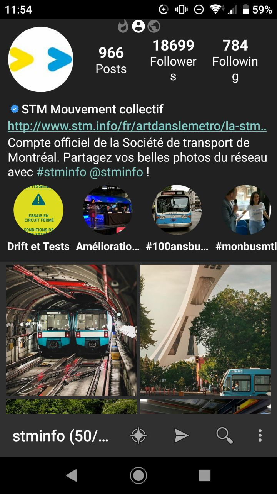
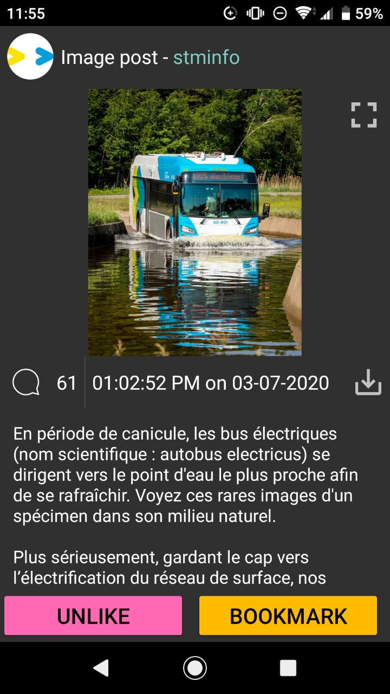
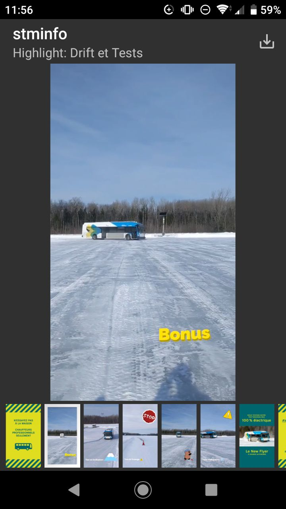
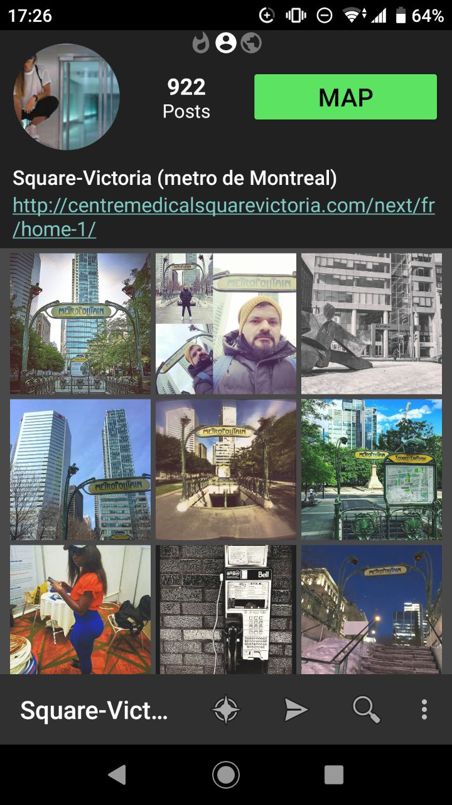

## InstaGrabber

*As featured on: [r/androidapps](https://www.reddit.com/r/androidapps/comments/i30tpp/instagrabber_an_open_source_instagram_client/) • [HowToMen](https://nitter.net/howtomen/status/1290443637625704450) • [GitHub Trending](https://github.com/ifyour/github-trending-archive/blob/master/archives/2020-08-05.md)*

InstaGrabber is an alternative Instagram client for Android. You can...

* **Search**: Profile / Hashtag / Location
* **Profile**: View posts (timeline & face-tagged), copy bio, view stories\* (Highlight & status), follow\*, restrict\*, block\*, compare following/followers\*,3
* **Hashtag**: View posts (newest only), view stories\*, follow\*
* **Location**: View posts (newest only), view stories\*, open map
* **Post**: View, download (+ batch download selected posts), copy captions, like/save\*
* **Story**: View (with [storiesig](https://storiesig.com) support1 and incognito mode2), download, interact with stickers\*, reply as DM\*
* **Comment**: View (+ copy), write\*, reply\*, like\*, delete\*
* **DM\***: View, download attachments, text reply
* Viewing\* your own feed, discover, saved, and liked posts
* Adding personal bookmarks to accounts/hashtags/locations locally

We support private accounts!\*

It can be used as a drop-in replacement for read (and some write) functionalities of the official Instagram app, with unnecessary components stripped.

* Requires [login](#how-to-log-in). You must be a current follower of the desired private accounts, this app cannot hack people (which I have to state despite the obvious)!

This app is originally made by [@AwaisKing](https://github.com/AwaisKing) who posted on [GitLab](https://gitlab.com/AwaisKing/instagrabber) but subsequently abandoned it. I decided to continue the app because it's just a great cause.

### Download

Download [here](https://github.com/austinhuang0131/instagrabber/releases/latest). [F-droid pending.](https://gitlab.com/fdroid/rfp/-/issues/1432)

### Contact us

* Use [GitHub issues](https://github.com/austinhuang0131/instagrabber/issues) when possible.
* Email: [InstaGrabber@AustinHuang.me](mailto:instagrabber@austinhuang.me) (Synced to GitHub issues)
* Matrix: [#InstaGrabber:matrix.org](https://matrix.to/#/#instagrabber:matrix.org)
* Telegram: [@Grabber_App](https://t.me/grabber_app)

### License

    InstaGrabber
    Copyright (C) 2019  AWAiS        <chapter50000@hotmail.com>
    Copyright (C) 2020  Austin Huang <im@austinhuang.me>
                        Ammar Githam <ammargitham786@gmail.com>

    This program is free software: you can redistribute it and/or modify
    it under the terms of the GNU General Public License as published by
    the Free Software Foundation, either version 3 of the License, or
    (at your option) any later version.

    This program is distributed in the hope that it will be useful,
    but WITHOUT ANY WARRANTY; without even the implied warranty of
    MERCHANTABILITY or FITNESS FOR A PARTICULAR PURPOSE.  See the
    GNU General Public License for more details.

    You should have received a copy of the GNU General Public License
    along with this program.  If not, see <https://www.gnu.org/licenses/>.

 

1. For anonymous users only, does not apply to users already logged in, and must be explicitly enabled in Settings. 2. Default enabled, but can be disabled. 3. Shameless plug: If you do not have an Android device but wants to do that, read [this](https://austinhuang.me/instagram-compare).
